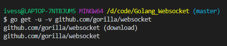
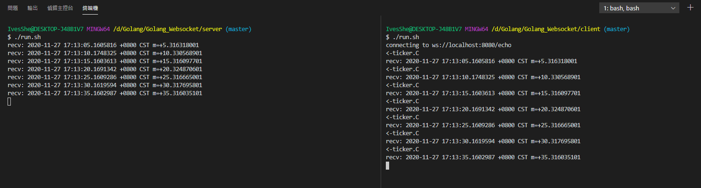

# Golang Websocket

下載並安裝

```shell
go get -u -v github.com/gorilla/websocket
```



# 執行結果

## 客戶端

- 客戶端每5秒會傳送現在時間給服務器
- 客戶端每2秒會傳送ping給服務器

## 服務器

服務器會回傳客戶端所傳送的資料，但當接收到ping時，會回傳pong，並打印"心跳"

# 執行畫面



# Server

server.go
```go
package main

import (
	"flag"
	"log"
	"net/url"
	"os"
	"os/signal"
	"time"

	"github.com/gorilla/websocket"
	"github.com/wonderivan/logger"
)

// 定義flag參數，這邊會返回一個相應的指針
var addr = flag.String("addr", "localhost:8080", "http service address")

func main() {
	// 調用flag.Parse()解析命令行參數到定義的flag
	flag.Parse()

	// SetFlags(flag int)可以用來自定義log的輸出格式
	log.SetFlags(0)

	// 定義一個os.Signal的通道
	interrupt := make(chan os.Signal, 1)

	// Notify函數讓signal包將輸入信號轉到interrupt
	signal.Notify(interrupt, os.Interrupt)

	// 處理連接的網址
	u := url.URL{Scheme: "ws", Host: *addr, Path: "/echo"}
	logger.Debug("connecting to %s", u.String())

	// 連接服務器
	c, _, err := websocket.DefaultDialer.Dial(u.String(), nil)
	if err != nil {
		log.Fatal("dial:", err)
	}

	// 預先關閉，此行在離開main時會執行
	defer c.Close()

	// 定義通道
	done := make(chan struct{})

	go func() {
		// 預先關閉，此行在離開本協程時執行
		defer close(done)
		for {
			// 一直待命讀資料
			_, message, err := c.ReadMessage()
			if err != nil {
				logger.Debug("read:", err)
				return
			}
			logger.Debug("recv: %s", message)
		}
	}()

	// NewTicker 返回一個新的Ticker
	// 該Ticker包含一個通道字段，並會每隔時間段d就向該通道發送當時的時間
	// 它會調整時間間隔或者丟棄tick信自以適應反應慢的接收者
	// 如果d <= 0 會觸發panic，關閉該Ticker可以釋放相關資源
	ticker := time.NewTicker(5 * time.Second)
	heartbeat := time.NewTicker(2 * time.Second)

	// 預先停止，此行在離開main時執行
	defer ticker.Stop()

	for {
		select {
		case <-done:
			// 返回
			return
		case t := <-ticker.C:
			// ticker定義的時間到了會執行這邊
			//log.Println("<-ticker.C")
			message := t.String()
			err := c.WriteMessage(websocket.TextMessage, []byte(message))
			if err != nil {
				logger.Debug("write:", err)
				return
			}
			logger.Debug("write:", message)
		case <-heartbeat.C:
			// ticker定義的時間到了會執行這邊
			//log.Println("<-heartbeat.C")
			message := "ping"
			err := c.WriteMessage(websocket.TextMessage, []byte(message))
			if err != nil {
				logger.Debug("write:", err)
				return
			}
			logger.Debug("write:", message)
		case <-interrupt:
			// 強制執行程序時，會進入這邊
			log.Println("interrupt")

			// Cleanly close the connection by sending a close message and then
			// waiting (with timeout) for the server to close the connection.
			// 關閉連結並寄出close的的id
			err := c.WriteMessage(websocket.CloseMessage, websocket.FormatCloseMessage(websocket.CloseNormalClosure, ""))
			if err != nil {
				logger.Debug("write close::", err)
				return
			}
			select {
			case <-done:
				// 結束完成會執行這邊
				logger.Debug("<-done")
			case <-time.After(10 * time.Second):
				// 超時處理，防止select阻塞著
				logger.Debug("<-time")
			}
			return
		}
	}
}
```

# Client

client.go
```go
package main

import (
	"flag"
	"log"
	"net/url"
	"os"
	"os/signal"
	"time"

	"github.com/gorilla/websocket"
	"github.com/wonderivan/logger"
)

// 定義flag參數，這邊會返回一個相應的指針
var addr = flag.String("addr", "localhost:8080", "http service address")

func main() {
	// 調用flag.Parse()解析命令行參數到定義的flag
	flag.Parse()

	// SetFlags(flag int)可以用來自定義log的輸出格式
	log.SetFlags(0)

	// 定義一個os.Signal的通道
	interrupt := make(chan os.Signal, 1)

	// Notify函數讓signal包將輸入信號轉到interrupt
	signal.Notify(interrupt, os.Interrupt)

	// 處理連接的網址
	u := url.URL{Scheme: "ws", Host: *addr, Path: "/echo"}
	logger.Debug("connecting to %s", u.String())

	// 連接服務器
	c, _, err := websocket.DefaultDialer.Dial(u.String(), nil)
	if err != nil {
		log.Fatal("dial:", err)
	}

	// 預先關閉，此行在離開main時會執行
	defer c.Close()

	// 定義通道
	done := make(chan struct{})

	go func() {
		// 預先關閉，此行在離開本協程時執行
		defer close(done)
		for {
			// 一直待命讀資料
			_, message, err := c.ReadMessage()
			if err != nil {
				logger.Debug("read:", err)
				return
			}
			logger.Debug("recv: %s", message)
		}
	}()

	// NewTicker 返回一個新的Ticker
	// 該Ticker包含一個通道字段，並會每隔時間段d就向該通道發送當時的時間
	// 它會調整時間間隔或者丟棄tick信自以適應反應慢的接收者
	// 如果d <= 0 會觸發panic，關閉該Ticker可以釋放相關資源
	ticker := time.NewTicker(5 * time.Second)
	heartbeat := time.NewTicker(2 * time.Second)

	// 預先停止，此行在離開main時執行
	defer ticker.Stop()

	for {
		select {
		case <-done:
			// 返回
			return
		case t := <-ticker.C:
			// ticker定義的時間到了會執行這邊
			//log.Println("<-ticker.C")
			message := t.String()
			err := c.WriteMessage(websocket.TextMessage, []byte(message))
			if err != nil {
				logger.Debug("write:", err)
				return
			}
			logger.Debug("write:", message)
		case <-heartbeat.C:
			// ticker定義的時間到了會執行這邊
			//log.Println("<-heartbeat.C")
			message := "ping"
			err := c.WriteMessage(websocket.TextMessage, []byte(message))
			if err != nil {
				logger.Debug("write:", err)
				return
			}
			logger.Debug("write:", message)
		case <-interrupt:
			// 強制執行程序時，會進入這邊
			log.Println("interrupt")

			// Cleanly close the connection by sending a close message and then
			// waiting (with timeout) for the server to close the connection.
			// 關閉連結並寄出close的的id
			err := c.WriteMessage(websocket.CloseMessage, websocket.FormatCloseMessage(websocket.CloseNormalClosure, ""))
			if err != nil {
				logger.Debug("write close::", err)
				return
			}
			select {
			case <-done:
				// 結束完成會執行這邊
				logger.Debug("<-done")
			case <-time.After(10 * time.Second):
				// 超時處理，防止select阻塞著
				logger.Debug("<-time")
			}
			return
		}
	}
}
```

# 小結

雖然本例子是從網路上找到不同的代碼所組合而成的，但在找尋golang與websocket的資料上花了一點時間，也試過很多不同的版本，最後覺得目前這個版本比較適合自己之後想要使用的型態，因為將程式閱讀執行、測試過，並寫下自己所理解的註解，方便之後回頭使用。