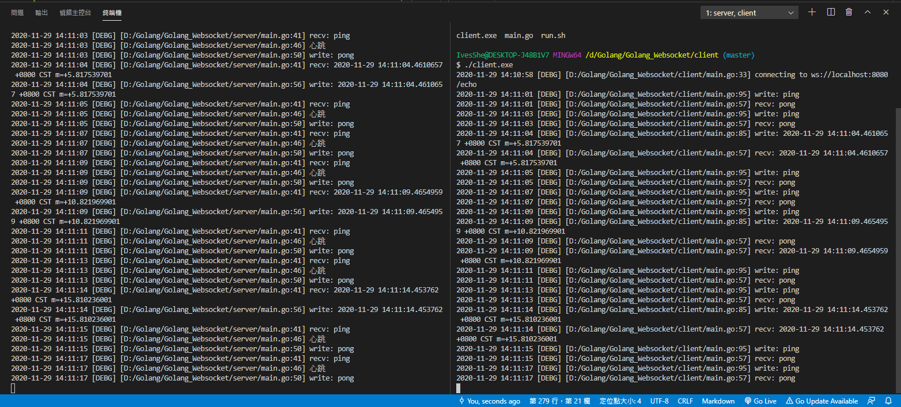

# Golang_Websocket

下載並安裝

```shell
go get -u -v github.com/gorilla/websocket
```


# Server

server.go
```go
package main

import (
	"flag"
	"html/template"
	"log"
	"net/http"

	"github.com/gorilla/websocket"
)

// 定義flag參數，這邊會返回一個相應的指針
var addr = flag.String("addr", "localhost:8080", "http service address")

var upgrader = websocket.Upgrader{} // use default options

func echo(w http.ResponseWriter, r *http.Request) {
	// 開啟websocket服務
	c, err := upgrader.Upgrade(w, r, nil)
	if err != nil {
		log.Print("upgrade:", err)
		return
	}

	// 預先關閉，此行在離開echo時會執行
	defer c.Close()

	// 一直待命收資料
	for {
		// 讀取資料
		mt, message, err := c.ReadMessage()
		if err != nil {
			log.Println("read:", err)
			break
		}
		log.Printf("recv: %s", message)

		// 將讀到的資料送出
		err = c.WriteMessage(mt, message)
		if err != nil {
			log.Println("write:", err)
			break
		}
	}
}

// 這邊會產生一個實體網頁
func home(w http.ResponseWriter, r *http.Request) {
	homeTemplate.Execute(w, "ws://"+r.Host+"/echo")
}

func main() {
	// 調用flag.Parse()解析命令行參數到定義的flag
	flag.Parse()

	// SetFlags(flag int)可以用來自定義log的輸出格式
	log.SetFlags(0)

	// 處理/echo的路由
	http.HandleFunc("/echo", echo)

	// 處理/的路由
	http.HandleFunc("/", home)

	// addr是指針，所以加*取值
	log.Fatal(http.ListenAndServe(*addr, nil))
}

// 網頁html
var homeTemplate = template.Must(template.New("").Parse(`
<!DOCTYPE html>
<html>
<head>
<meta charset="utf-8">
<script>  
window.addEventListener("load", function(evt) {

    var output = document.getElementById("output");
    var input = document.getElementById("input");
    var ws;

    var print = function(message) {
        var d = document.createElement("div");
        d.textContent = message;
        output.appendChild(d);
    };

    document.getElementById("open").onclick = function(evt) {
        if (ws) {
            return false;
        }
        ws = new WebSocket("{{.}}");
        ws.onopen = function(evt) {
            print("OPEN");
        }
        ws.onclose = function(evt) {
            print("CLOSE");
            ws = null;
        }
        ws.onmessage = function(evt) {
            print("RESPONSE: " + evt.data);
        }
        ws.onerror = function(evt) {
            print("ERROR: " + evt.data);
        }
        return false;
    };

    document.getElementById("send").onclick = function(evt) {
        if (!ws) {
            return false;
        }
        print("SEND: " + input.value);
        ws.send(input.value);
        return false;
    };

    document.getElementById("close").onclick = function(evt) {
        if (!ws) {
            return false;
        }
        ws.close();
        return false;
    };

});
</script>
</head>
<body>
<table>
<tr><td valign="top" width="50%">
<p>Click "Open" to create a connection to the server, 
"Send" to send a message to the server and "Close" to close the connection. 
You can change the message and send multiple times.
<p>
<form>
<button id="open">Open</button>
<button id="close">Close</button>
<p><input id="input" type="text" value="Hello world!">
<button id="send">Send</button>
</form>
</td><td valign="top" width="50%">
<div id="output"></div>
</td></tr></table>
</body>
</html>
`))

```

# Client

client.go
```go
package main

import (
	"flag"
	"log"
	"net/url"
	"os"
	"os/signal"
	"time"

	"github.com/gorilla/websocket"
)

// 定義flag參數，這邊會返回一個相應的指針
var addr = flag.String("addr", "localhost:8080", "http service address")

func main() {
	// 調用flag.Parse()解析命令行參數到定義的flag
	flag.Parse()

	// SetFlags(flag int)可以用來自定義log的輸出格式
	log.SetFlags(0)

	// 定義一個os.Signal的通道
	interrupt := make(chan os.Signal, 1)

	// Notify函數讓signal包將輸入信號轉到interrupt
	signal.Notify(interrupt, os.Interrupt)

	// 處理連接的網址
	u := url.URL{Scheme: "ws", Host: *addr, Path: "/echo"}
	log.Printf("connecting to %s", u.String())

	// 連接服務器
	c, _, err := websocket.DefaultDialer.Dial(u.String(), nil)
	if err != nil {
		log.Fatal("dial:", err)
	}

	// 預先關閉，此行在離開main時會執行
	defer c.Close()

	// 定義通道
	done := make(chan struct{})

	go func() {
		// 預先關閉，此行在離開本協程時執行
		defer close(done)
		for {
			// 一直待命讀資料
			_, message, err := c.ReadMessage()
			if err != nil {
				log.Println("read:", err)
				return
			}
			log.Printf("recv: %s", message)
		}
	}()

	// NewTicker 返回一個新的Ticker
	// 該Ticker包含一個通道字段，並會每隔時間段d就向該通道發送當時的時間
	// 它會調整時間間隔或者丟棄tick信自以適應反應慢的接收者
	// 如果d <= 0 會觸發panic，關閉該Ticker可以釋放相關資源
	ticker := time.NewTicker(5 * time.Second)

	// 預先停止，此行在離開main時執行
	defer ticker.Stop()

	for {
		select {
		case <-done:
			// 返回
			return
		case t := <-ticker.C:
			// ticker定義的時間到了會執行這邊
			log.Println("<-ticker.C")
			err := c.WriteMessage(websocket.TextMessage, []byte(t.String()))
			if err != nil {
				log.Println("write:", err)
				return
			}
		case <-interrupt:
			// 強制執行程序時，會進入這邊
			log.Println("interrupt")

			// Cleanly close the connection by sending a close message and then
			// waiting (with timeout) for the server to close the connection.
			// 關閉連結並寄出close的的id
			err := c.WriteMessage(websocket.CloseMessage, websocket.FormatCloseMessage(websocket.CloseNormalClosure, ""))
			if err != nil {
				log.Println("write close:", err)
				return
			}
			select {
			case <-done:
				// 結束完成會執行這邊
				log.Println("<-done")
			case <-time.After(10 * time.Second):
				// 超時處理，防止select阻塞著
				log.Println("<-time")
			}
			return
		}
	}
}
```

# 執行結果



# 小結

雖然本例子是從官網上找到的，但在找尋golang與websocket的資料上花了一點時間，也試過很多不同的版本，最後覺得本例子可能比較適合自己之後想要使用的型態，因為將程式閱讀執行、測試過，並寫下自己所理解的註解，方便之後回頭使用。